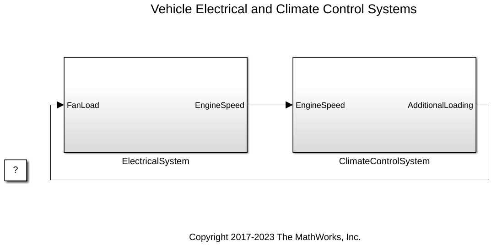
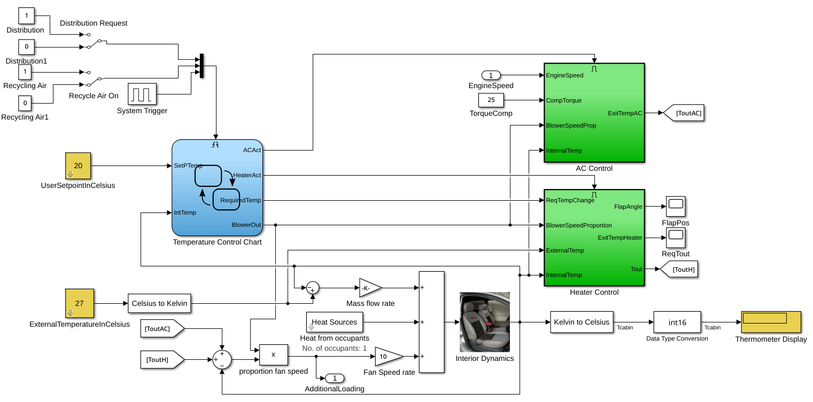
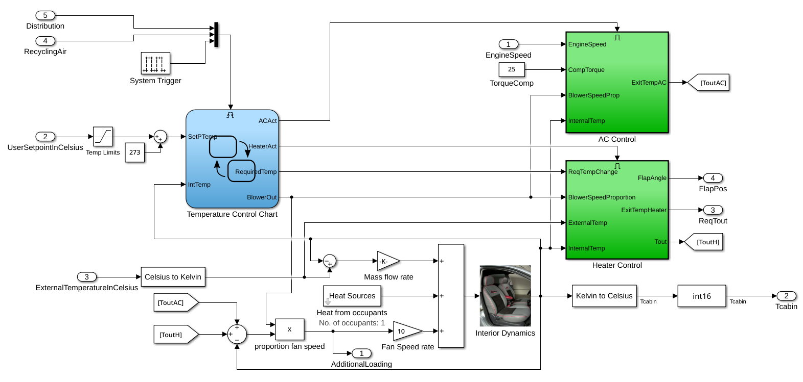
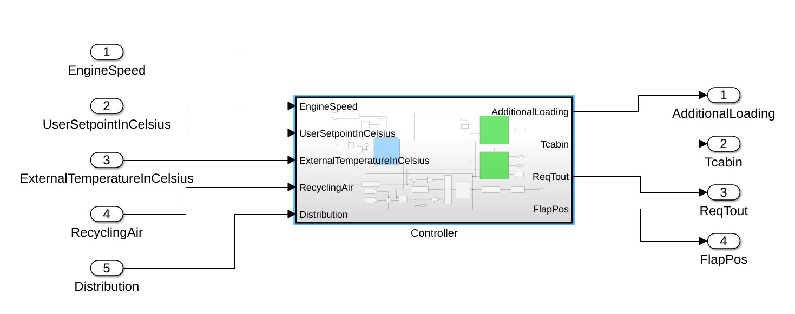
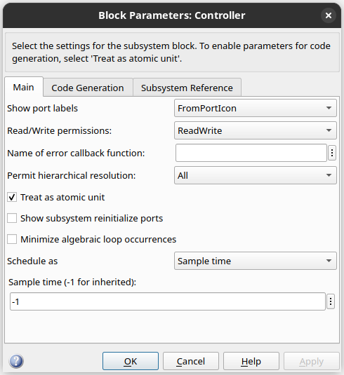
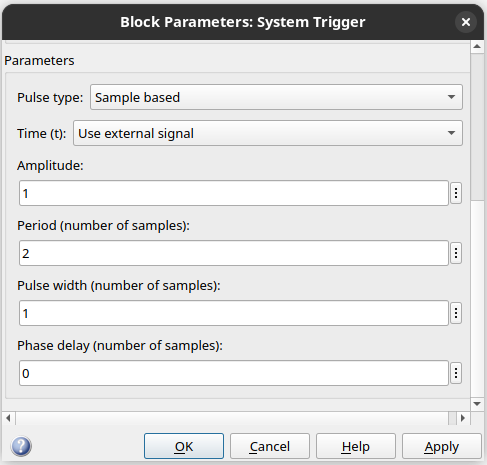
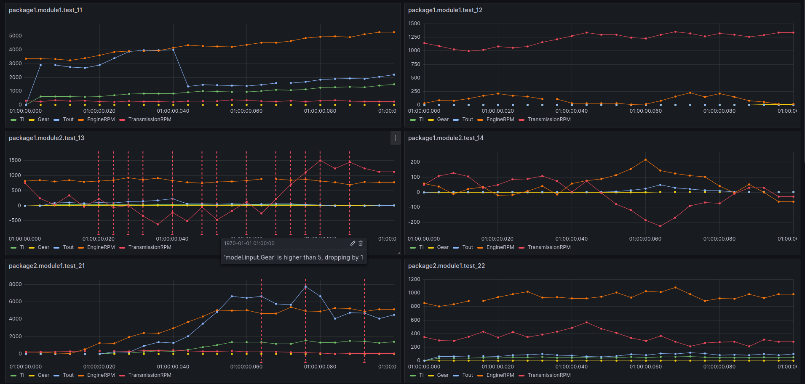

# Simbind CLI

Generate Python wheel package from Simulink model!

## Motivation

Simbind emerges as a foundational element of an ambitious initiative, bridging the gap between model-based development
and the rich capabilities of the Python ecosystem. The output Python package doesn't need Matlab and has no Python
dependencies opening a broad range of possibilities: from developing integration tests to deploying your model as a
standalone application.

## Limitations

Like any tool, Simbind comes with its own set of limitations. While some are due to prioritization of features and may
be addressed in future updates, others are inherent to the external tools we integrate with.

- The output Python package is currently compatible with Linux x86-64 only. However, we're open to extending support to
  Linux ARM and Windows x86-64 if there's sufficient interest!

- Due to nature of binding technology you can instantiate _Model_ class only once within single process, all consequent
  instances will have the same state(time, input and output props) as the first instance. If you need to instantiate
  multiple objects we recommend to do it in the separate processes.

- If your model is part of a larger simulation, ensure that the _.slx_ file is self-sufficient. In Matlab/Simulink
  terms,
  this means that the model should be an 'atomic subsystem', functioning independently without relying on external
  components. You can refer to <a href="https://www.mathworks.com/help/simulink/ug/creating-subsystems.html">this article</a>.

- Simulink model must have data type consistency, ensuring that there's no mismatch between the ports and signals.

- Incorporating real-time clock or time-dependant components demands precise alignment with the selected time step size,
  and therefore, we recommend caution in their use.

## Requirements

- You need Linux x86-64 machine with installed Matlab.
- From Matlab side you need Simulink suite with Simulink Coder.
- You also need gcc, cmake, make and swig. Under Debian-based distros you can install it with
  ```bash
  sudo apt-get install build-essential cmake swig
  ```

## Prepare the Model

To illustrate the process and show possible issues I will pick 'Climate Control System', part of 'Electrical Vehicle And
Climate Control Systems Example' from Matlab library. You can open it with

```matlab
openExample('simulink_automotive/VehicleElectricalAndClimateControlSystemsExample')
```


<div style="text-align: center;">

    <br>
    <em>Electrical Vehicle And Climate Control Systems Example. Copyright 2017-2023 The MathWorks, Inc. All rights reserved.</em>
</div>

Open 'ClimateControlSystem' block:

<div style="text-align: center;">

    <br>
    <em>Climate Control System Example. Copyright 2017-2023 The MathWorks, Inc. All rights reserved.</em>
</div>

In the first step we need to define _In_ and _Out_ ports of our model, for these lets:

- Substitute all _Scope_ and _Display_ components with _Out_ ports.
- Turn some _Constants_ into _In_ ports.

Here is how model looks like after the changes are applied:

<div style="text-align: center;">

    <br>
    <em>Climate Control System Example with defined In and Out ports. Copyright 2017-2023 The MathWorks, Inc. All rights reserved.</em>
</div>

Next let's make a subsystem from resulting model, select everything, right-click and choose 'Create Subsystem from
Selection':

<div style="text-align: center;">

    <br>
    <em>Climate Control System Example Subsystem. Copyright 2017-2023 The MathWorks, Inc. All rights reserved.</em>
</div>

Now we need to make model atomic to make sure that all relevant functionality is encapsulated within model itself and
does not depend on external components. Right-click on your subsystem and select 'Block Parameters (Subsystem)' and
select 'Treat as atomic unit':

<div style="text-align: center;">

    <br>
    <em>Subsystem Block parameters. Copyright 2017-2023 The MathWorks, Inc. All rights reserved.</em>
</div>

Save your model and let's try to build model with:

```bash
$ python -m simbind \
  --slx-path=/path/to/Controller.slx \
  --pkg-name=climate_control \
  --solver=ode5 \
  --step=0.001
```

There is certain chance that you will encounter some issue. Let's iterate over most common ones:

- If version of local Matlab/Simulink lower than the version Model was created with you will gain following error:
  ```
  Model version was created with newer Matlab Release. It should be compatible with 'R2023a'.
  ```
  To address this issue you will need to <a href="https://www.mathworks.com/help/simulink/ug/save-models.html">Export
  Model to Previous Version of Simulink</a>.
- After we saved model with proper version we are going to face another problem:
  ```
  Error in 'SimulinkModel/Controller/System Trigger': The computed sample time (0.000333333) is not an integer multiple of the fixed step size (0.001). The period, pulse width and phase delay parameters of this block need to be integer multiples of the fixed step size.
  ```
  Error caused by _System Trigger_ component, while working perfectly fine in simulation with continues time, it will
  fail
  to be discretized. There are multiple ways on how to solve this problem. If your model is part of much larger system,
  you might want to have dedicated clock signal to synchronise all components. To keep example simple I have just
  changed _Pulse type_ from _Time based_ to _Sample based_ and adjusted other parameters accordingly:

  <div style="text-align: center;">
  
      <br>
      <em>System Trigger Block parameters. Copyright 2017-2023 The MathWorks, Inc. All rights reserved.</em>
  </div>

- If at any of above-mentioned steps you have transformed your model
  into <a href="https://www.mathworks.com/help/rtw/referenced-models-1.html">Referenced Model</a> to avoid deleting
  _Scopes_, _Displays_ or similar components, you might encounter following problem:
  ```
  Data type mismatch. 'Input Port 1' of 'SimulinkModel/Heater Control/ExitTempHeater' expects a signal of data type 'int16'. However, it is driven by a signal of data type 'double'.
  ```
  That error happens due to wrong types attached to inner/outer ports by Simulink during encapsulation. You will need
  manually iterate over all mismatched ports and assign proper types or specifying _auto_ types.

If you encounter an unexpected error or feel that some problem requires better error handling, please let us know, by
opening the issue or contacting directly using _contact@swag-engineering.io_, and we would be glad to help!

## Python Package Structure

During the import I gave my model name _climate_control_ with _1ms_ time step. After model got digested I have got
_climate_control-1.0-py3-none-linux_x86_64.whl_, that is Python wheel package that you can install with _pip_:

``` bash
$ pip install climate_control-1.0-py3-none-linux_x86_64.whl
```

In every package generated by Simbind, you will find a _Model_ class. This Model class is the primary class you will
interact with.
<details>
<summary>Let's explore its structure and capabilities</summary>

```
>>> from climate_control import Model
>>> help(Model)

Help on class Model in module climate_control.Model:
class Model(climate_control.BaseModel.BaseModel)
 |  Model(collector_callback=None)
 |
 ...
 |  
 |  initialize(self) -> None
 |  
 |  step(self) -> None
 |  
 |  terminate(self) -> None
 |  
 |  ----------------------------------------------------------------------
 |  Readonly properties defined here:
 |  
 |  input
 |      Input interface of the model. Available properties:
 |          EngineSpeed: float
 |          UserSetpointInCelsius: float
 |          ExternalTemperatureInCelsius: float
 |          RecyclingAir: float
 |          Distribution: float
 |  
 |  output
 |      Output interface of the model. Available properties:
 |          AdditionalLoading: float
 |          Tcabin: int
 |          ReqTout: float
 |          FlapPos: float
 |  
 |  time
 ...
```

</details>

You can see here that the _Model_ class defines three methods: _initialize_, _step_, and _terminate_. The _initialize_
method will
be called automatically upon object instantiation, so there's no need to call it manually. As for the _terminate_
method,
it is generally of limited utility in this context. In most cases, Simulink does not generate substantial code for this
method. Additionally, given that reinstantiating the object within the same process is not possible, calling _terminate_
is typically redundant and can be disregarded. The primary focus for interaction with the _Model_ class is the _step_
method. Each time you invoke the _step_ method, the _Model_ recalculates its output based on the provided input and
increments the time property. This method is crucial for simulating a step in the model's execution and obtaining the
corresponding output for a given set of inputs.

Within the properties block, you will find three key properties that are pivotal to our operations: _input_, _output_,
and
_time_. The _input_ and _output_ properties grant direct access to the corresponding _In_ and _Out_ ports as defined
within the
Simulink model.The _time_ property, as mentioned earlier, increments by the specified step size each time you invoke the
_step_ method. This allows you to iterate over the simulated time as follows:

```python
model = Model()
break_point = model.time + 10  # wait 10 seconds
while model.time < break_point:
    model.step()
```

Following best testing practices, it is advisable to rely solely on the _time_ property for consistent behavior. We
caution against using the _output_ property to trigger changes within a loop, as this could potentially result in an
infinite loop if the anticipated output value is never reached. Therefore, we recommend avoiding code patterns like
this:

```python
while model.output.some_prop < some_value:
    model.step()
```

## Pytest Notes

To understand underlying problem of integrating Simbind Python package with _pytest_ let's make a sketch of ideal
scenario:

```python
# conftest.py

import pytest

from model import Model


@pytest.fixture
def model():
    return Model()
```

```python
# some_test.py

def test_something(model):
    model.input.some_prop = some_value
    break_point = model.time + 5
    while model.time < break_point:
        model.step()
    assert model.output.another_prop == another_value
```

Here we created fixture that returns _Model_ object with intention to use it in _test_something_. With single test it
works
perfectly, but you will encounter weird behaviour if you will define one more test function. The reason of this
behaviour explained in [limitations](#limitations):

- Due to nature of binding technology you can instantiate _Model_ class only once within single process, all consequent
  instances will have the same state(time, input and output props) as the first instance. If you need to instantiate
  multiple objects we recommend to do it in the separate processes.

That essentially means even though _pytest_ is designed to create a fresh _Model_ object for each test, the second test
picking up right where the first one left off. In other words, the second test inherits the _Model_'s state from the
end of the first test! To tackle this issue, you'll need to ensure that pytest not only runs each test in a new process
but also instantiates the fixture in this new process.

As for the moment we discovered two practical solutions to this problem:

- From fixture return _Model_ class and then create the object inside the test function itself:
  ```python
  # conftest.py
  
  @pytest.fixture
  def model_class():
      return Model
  ```
  ```python
  # some_test.py

  def test_something(model_class):
    model = model_class()
    ...
  ```
  To ensure that each test function runs in its own separate process, you can make use of the _pytest-xdist_ plugin.

- Another approach is to write your own _pytest_ plugin. This option provides tons of flexibility, allowing you to
  tailor
  the testing environment to your specific needs. However, be prepared to dig deep into the pytest documentation to make
  this work. The good news? We've already implemented this solution in our [Simweb Project](#simweb-perks)!

## Simweb Perks

Recognizing variety of challenges and complexities that engineers encounter daily, we've initiated the Simweb project, a
web platform designed to offer a comprehensive suite of integrations and a streamlined workflow to simplify
Software-in-the-Loop tests development, as well as results analysis. To highlight a few key advantages:

- Automated Simbind CI Cloud pipeline
- Git automation for models and tests versioning.
- Pytest integration.
- Cloud-based tests execution with data and logs visualization.
- Model test mocks to facilitate local test development.

<div style="text-align: center;">

    <br>
    <em>Simweb and Grafana integration.</em>
</div>

If you believe this this aligns with your needs, we would love to hear from you! Reach out, and we would be delighted to
arrange a demo for you! Moreover, we are starting the work on Hardware-in-the-Loop integration and looking for
collaborative partnerships with companies that focuses on hardware related Model-based development. We're eager to
understand your specific requirements and tailor Simweb to meet your unique operational needs!