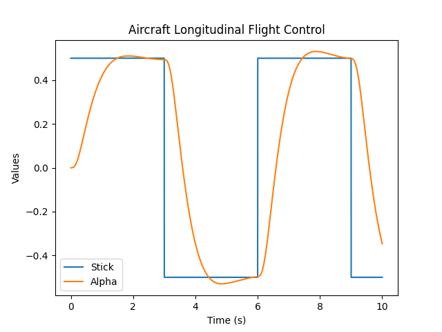
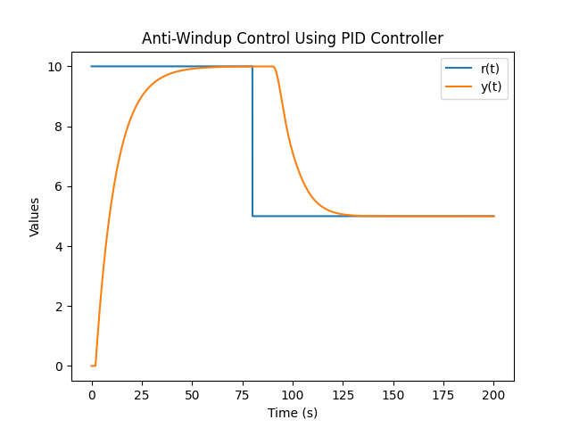
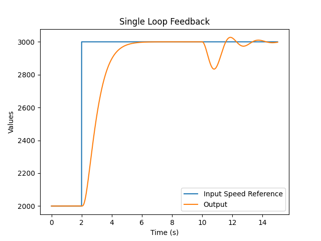

# Example Models

This folder contains set of example models from MathWorks repositories alongside with generated Python Packages. Models
were slightly modified according the process described
in [Wiki](https://github.com/swag-engineering/simbind-cli/wiki/Prepare-the-Model). Some of the models also equipped with usage example:

- [Longitudinal Flight Control](https://www.mathworks.com/help/simulink/slref/aircraft-longitudinal-flight-control.html)
  
- [Anti-Windup Pid Controller](https://www.mathworks.com/help/simulink/slref/anti-windup-control-using-a-pid-controller.html)
  
- [Single Loop Feedback](https://www.mathworks.com/help/slcontrol/ug/single-loop-feedbackprefilter-compensator-design.html)
  
- [Climate Controller](https://www.mathworks.com/help/simulink/slref/simulating-automatic-climate-control-systems.html)
- [Transmission](https://www.mathworks.com/help/simulink/slref/modeling-an-automatic-transmission-controller.html)